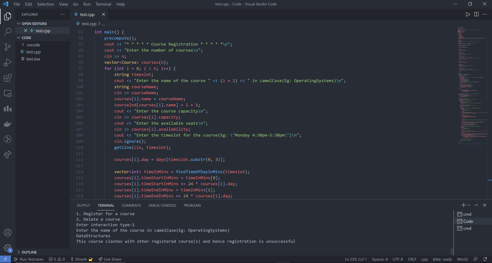
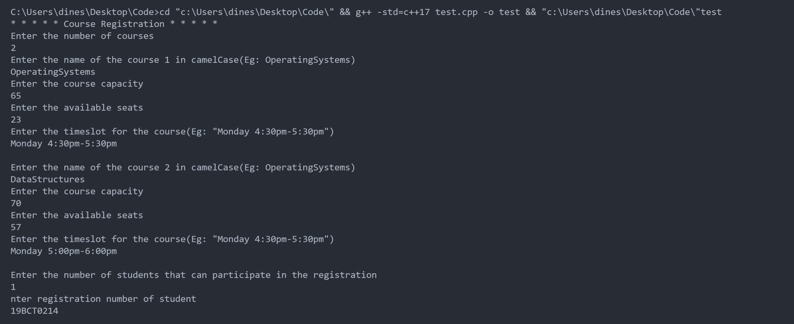
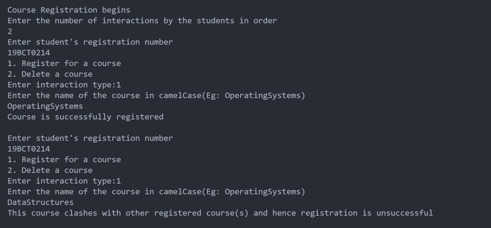

# Course Allocation

A fully capable C++ code which can allow students to register themselves for their college semester courses.
This is a task for the Assignment Round of Motorq Intership hiring process.

## About the project

An admin has to provide a list of all the courses that can be registered by the student.

Course details include
- Course name
- Course capacity
- No. of seats left
- Course timeline

After this, the admin also provides a list of eligible students to take part in the registration process by entering student's registration number

Next, the students' interactions with the portal are recorded in order and provided as input
The students can either register or delete a particular course by entering the name of the course.

## Implementation

- I've used Graph Data Structure for finding out the clashes between various courses
- I've used set Data structure to maintain a list of students registered for a course and the courses registered by a student
- Used Queue Data structure to maintain the waiting list for a particular course
- Two classes namely "Course" and "Student" are used to store the structure of data in the program
- Map Data Structure is used for quickly retrieving the details of any particular course or student using their names and registration numbers respectively
- Vectors are used to maintain the list of Students and Courses. It is also used to implement the Graph data structure.

- Everything possible corner case that I could think of has been handled and verified.

## Code & Output screenshots





## Getting Started

These instructions will get you a copy of the project up and running on your local machine for development and testing purposes.

### Prerequisites

Please make sure you've already installed MinGw for executing C++ code.

- Clone this repository:

```
git clone https://github.com/DineshBS44/Course-Allocation
```

### Run

Open the `CourseRegistration.cpp` file in any code editor and run the code.
The console window can be used for registering/deleting the course.

## Developer

- **Dinesh B S** [(@DineshBS44)](https://github.com/DineshBS44)

<br>
<br>
